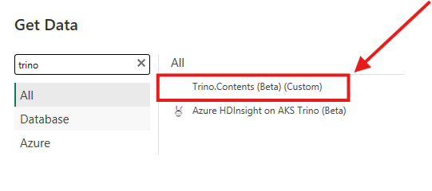
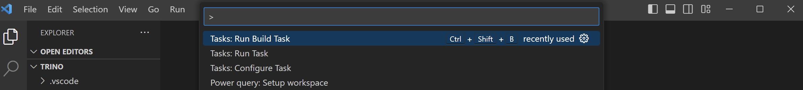
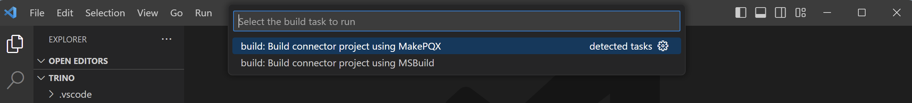

# Conector Trino para Power BI
## Descrição
O conector será utilizado para conectar o Power BI no Trino e ser capaz de acessar todos os seus catálogos que o Trino enxerga.

Se tudo acontecer conforme o esperado, será adicionado um novo conector do Trino no Power BI.

## Pré-requisitos
* Trino
* Power BI
* Power Query SDK (Extensão VS Code)

## Instruções

1. Instale o [Visual Studio Code](https://code.visualstudio.com/) e a [Power Query SDK
extension](https://marketplace.visualstudio.com/items?itemName=PowerQuery.vscode-powerquery-sdk).

2. Crie uma pasta em documentos com o nome "Power BI Desktop" e dentro da pasta crie ou tra pasta com o "Custom Connectors"

3. Abra o Visual Studio dentro dessa pasta.

4. Clone este repositório e abra a pasta Trino no Visual Studio Code. (Se você abrir a pasta principal deste repositório, a extensão do Power Query SDK não o reconhecerá como um projeto de extensão.)

5. Deletar/Apagar a pasta Bin.

6. Agora, o arquivo .mez precisa ser compilado. Na Paleta de Comandos, selecione "Tarefas: Executar Tarefa de Compilação" (digite "> b" para encontrá-lo):
    

    Em seguida, selecione a opção para usar MakePQX:

    

    Se tudo correr bem, o arquivo  `Trino.mez`  deverá aparecer na pasta `Trino\\bin\\AnyCPU\\Debug`. 

7. Pegue o .mez pré-criado deste link ou, se personalizado, da sua pasta de depuração e coloque-o na sua Documents\Power BI Desktop\Custom Connectors.

8. Na configurações do Power BI, permita configuração com qualquer conector. Veja como fazer isso no [link](https://learn.microsoft.com/en-us/power-bi/connect-data/desktop-connector-extensibility#certified-connectors). E após reinicie o Power BI

9. Uma vez feito isso, você deverá conseguir ver o conector listado na janela "Obter Dados".

## Vídeo tutorial

[Trino Community Broacast 61: Trino powers business intelligence](https://www.youtube.com/watch?v=YlcfTP5ei80&t=689s)

[Como conectar o Power BI no Trino](https://www.youtube.com/watch?v=4eWgjd1Etrw&t=320s)

## Referências
https://github.com/CreativeDataEU/PowerBITrinoConnector

## Developer
| Desenvolvedor      | LinkedIn                                   | Email                        |
|--------------------|--------------------------------------------|------------------------------|
| Marcos Apolinário  | [LinkedIn](https://www.linkedin.com/in/marcos-apolinario/) | marcosapo01@gmail.com        |
